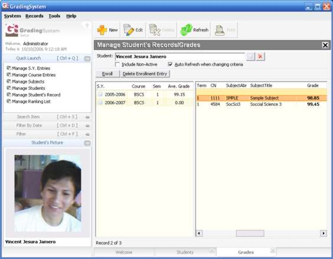



## b8 GS \- Grading System

### Description

A simple grading system for college level institutions.
 
### More Info
 

             |
---                |---
**Submitted On**   |2006-10-10 16:09:56
**By**             |[bob8works](https://github.com/Planet-Source-Code/PSCIndex/blob/master/ByAuthor/bob8works.md)
**Level**          |Intermediate
**User Rating**    |4.9 (289 globes from 59 users)
**Compatibility**  |VB 5\.0, VB 6\.0, VBA MS Access
**Category**       |[Complete Applications](https://github.com/Planet-Source-Code/PSCIndex/blob/master/ByCategory/complete-applications__1-27.md)
**World**          |[Visual Basic](https://github.com/Planet-Source-Code/PSCIndex/blob/master/ByWorld/visual-basic.md)
**Archive File**   |[b8\_GS\_\-\_Gr2056783292007\.zip](https://github.com/Planet-Source-Code/bob8works-b8-gs-grading-system__1-66682/archive/master.zip)

